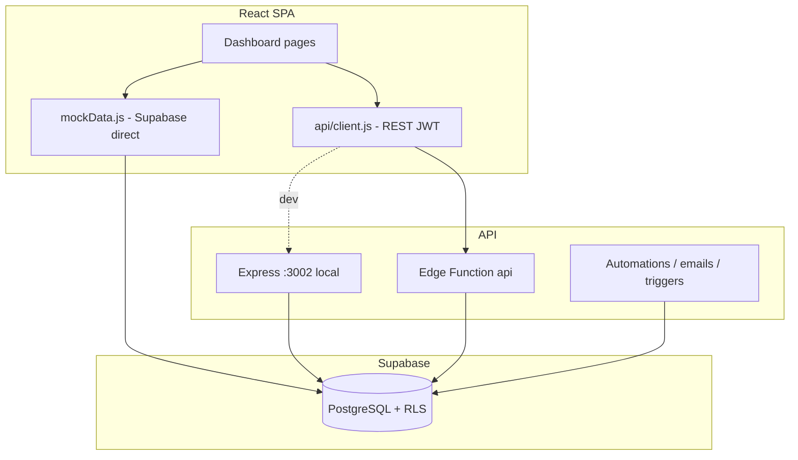
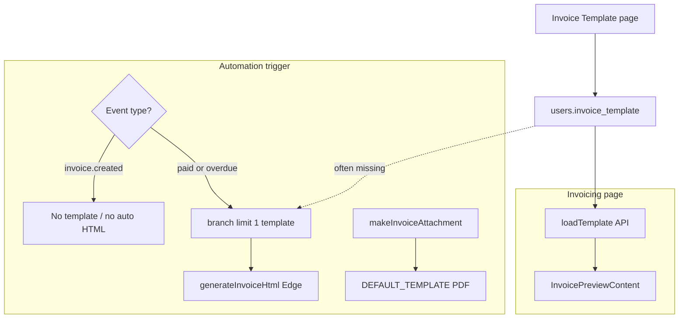

# Acodera CRM — Complete Analysis Report

**Project:** CRM-Acodera (`crm-login/`)  
**Date:** May 18, 2026  
**Scope:** Architecture, security, code quality, invoice template save bug, automation invoice styling

---

## Table of contents

1. [Executive summary](#1-executive-summary)
2. [Software overview](#2-software-overview)
3. [Code neatness assessment](#3-code-neatness-assessment)
4. [Security assessment](#4-security-assessment)
5. [Invoice template: save reverts to old data](#5-invoice-template-save-reverts-to-old-data)
6. [Automation vs invoicing preview mismatch](#6-automation-vs-invoicing-preview-mismatch)
7. [Recommended remediation priority](#7-recommended-remediation-priority)

---

## 1. Executive summary

| Question | Verdict |
|----------|---------|
| **What is this app?** | Multi-branch CRM: contacts, pipeline, invoicing, tickets, email automations, analytics, reviews, admin, Midtrans payments. |
| **Is the code neat?** | **Partially (~5/10).** UI is organized; backend has duplicate paths (Express + Edge, API + direct Supabase). |
| **Is it safe from cyber attacks?** | **No — not production-safe as-is.** Critical: service-role Supabase key in frontend bundle. |
| **Invoice template save bug?** | Save can appear to work while reload shows old data (cache, merge logic, DB not updated, or branch mismatch). |
| **Automation invoice emails?** | Do **not** match invoicing preview; `invoice.created` is excluded from server template logic; PDFs use default template. |

---

## 2. Software overview

### 2.1 Tech stack

| Layer | Technology |
|-------|------------|
| Frontend | React 18, Vite 5, React Router 7, Tailwind 3, Framer Motion, Recharts |
| Local API | Node.js Express 4 (ESM), Zod, bcrypt, JWT, helmet, rate limiting |
| Production API | Supabase Edge Functions (Deno) — mirrors Express under `supabase/functions/api/` |
| Database | PostgreSQL on Supabase (legacy MySQL docs still in `DATABASE_SETUP.md`) |
| Auth | Custom JWT (24h) + bcrypt; Supabase Auth only as OAuth bridge |
| Email | Brevo via Edge Functions (`process-automations`, `trigger-automation`, etc.) |
| Payments | Midtrans webhooks + gateway adapters |
| Hosting | Netlify (SPA); optional Render (`render.yaml`) |

### 2.2 Architecture



**Important:** CRM data (contacts, flows, invoices, automations) is often read/written **directly from the browser** via `@supabase/supabase-js` in `src/utils/mockData.js`. Admin, auth, gateway, and invoice template use the **REST API**.

### 2.3 Main features (routes)

| Module | Path | Purpose |
|--------|------|---------|
| Dashboard | `/dashboard` | KPIs, charts |
| Contacts | `/dashboard/contacts` | CRM contacts |
| Automation | `/dashboard/automation` | Email rules, logs |
| Pipeline | `/dashboard/flow` | Deal stages |
| Invoicing | `/dashboard/invoicing` | Invoices + preview |
| Invoice template | `/dashboard/invoicing/template` | Branding/settings |
| Tickets | `/dashboard/tickets` | Event tickets |
| Analytics | `/dashboard/analytics` | Charts |
| Reviews | `/dashboard/reviews` | Customer reviews |
| Admin | `/dashboard/admin/*` | Users, API keys, audit, gateway (owner) |

### 2.4 Data model (key tables)

| Table | Purpose |
|-------|---------|
| `users` | Accounts, roles, `branch` / `branch_id`, `invoice_template` JSONB, gateway config |
| `contacts`, `flows`, `automations`, `transactions`, `tickets`, `reviews` | Core CRM (branch-scoped) |
| `invoice_templates` | **Defined in schema but unused by the app** — app uses `users.invoice_template` |
| `api_keys`, `audit_logs`, `automation_logs`, `scheduled_emails` | Ops / integrations |

---

## 3. Code neatness assessment

### 3.1 Strengths

- Feature-based pages under `src/pages/`
- Shared UI components and dashboard shell
- Express uses helmet, rate limiting, Zod, bcrypt
- Midtrans webhook signature verification
- API keys stored as SHA-256 hashes
- Edge registration requires email verification code

### 3.2 Weaknesses

- **Two backends** (Express + Edge) must stay in sync
- **Two data paths:** REST API vs direct Supabase in `mockData.js` (~1,200 lines)
- `server/index.js` comment claims tenant validation on data routes, but `validateTenantAccess` is **never mounted**
- `DATABASE_SETUP.md` still documents MySQL; stack is Supabase Postgres
- Hardcoded Supabase URL/keys in source
- Duplicate `AuthProvider` in `main.jsx` and `App.jsx`
- JavaScript only (no TypeScript)
- Unused `invoice_templates` table vs `users.invoice_template` column — confusing schema

**Neatness score:** ~5/10 — workable for a small team, not audit-ready.

---

## 4. Security assessment

### 4.1 Short answer

**Not safe for production** until critical issues are fixed. Treat deployment as **compromised** until Supabase keys are rotated and service-role is removed from the browser.

### 4.2 Critical — fix immediately

#### 4.2.1 Service role key exposed in frontend

**File:** `src/utils/mockData.js` — `triggerAutomationEvent` (~lines 1160–1167)

Sends a Supabase **`service_role` JWT** in `Authorization` from the browser.

**Impact:** Anyone can extract from the Netlify/JS bundle → **full database admin access** (bypasses all RLS).

**Fix:** Rotate service_role key; never ship service role in client; trigger automations server-side only.

#### 4.2.2 Hardcoded Supabase anon key

**Files:** `src/lib/supabase.js`, `src/utils/templateApi.js`

Anon key embedded as fallback when env vars are missing.

**Fix:** Remove hardcoded fallbacks; rotate anon key if repo is public.

### 4.3 High severity

| Issue | Location | Impact |
|-------|----------|--------|
| OAuth without session proof | `handleAuthOAuth`, `server/routes/auth.js` | Account takeover via `POST /api/auth/oauth` + victim email |
| Client-side tenant filtering only | `mockData.js` + anon Supabase client | RLS may not apply; cross-tenant risk if policies weak |
| Express contacts no branch filter | `server/routes/contacts.js` | IDOR — all contacts visible on Express |
| External API no table whitelist | `handleExternal` in Edge routes | API key may hit unintended tables |
| Branch template `limit(1)` | `trigger-automation`, `processor.js` | Wrong user's template for branch |

### 4.4 Medium severity

| Issue | Risk |
|-------|------|
| JWT in `localStorage` | XSS → session theft |
| `dangerouslySetInnerHTML` on invoices | Stored XSS via HTML templates |
| Open registration on Express | Spam accounts |
| CORS `origin: true` in production Express | Reflects any Origin |
| Optional `AUTOMATION_SECRET` | Automation endpoint open if unset |
| `/seed` endpoint | Destructive SQL if secret leaks |

### 4.5 Security positives

- bcrypt passwords (cost 10)
- JWT_SECRET required at Express startup
- Auth rate limiting (20 / 15 min)
- Global API rate limiting
- Midtrans webhook signature verification
- API keys SHA-256 hashed
- Netlify CSP headers
- Edge registration email verification
- External API audit logging (Edge)

### 4.6 Architecture risk

The app mixes **safe** patterns (server API + service role) with **unsafe shortcuts** (browser → Supabase with anon key; service role in bundle). Attackers follow the shortcuts.

---

## 5. Invoice template: save reverts to old data

### 5.1 How save/load works

| Step | Behavior |
|------|----------|
| **Save** | `PUT /api/invoice-template` → writes JSON to `users.invoice_template` for logged-in user |
| **Load** | `GET /api/invoice-template` on page mount via `loadTemplate()` |
| **Storage** | `users.invoice_template` column — **not** the `invoice_templates` table |

Files: `src/utils/templateApi.js`, `src/pages/InvoiceTemplate.jsx`, `supabase/functions/api/routes.ts` (`handleInvoiceTemplate`).

### 5.2 Why "Saved!" but old data returns

#### Cause A — No re-fetch after save; stale GET cache

After save, UI only shows "Saved!" — it does **not** call `loadTemplate()` again.

`fetchTemplate()` uses plain `fetch` without `cache: 'no-store'`. API does not send `Cache-Control: no-store`.

**Symptom:** Saved on page → navigate away / refresh → old values. Staying on page still shows edits.

#### Cause B — `loadTemplate()` merge skips empty fields

```javascript
// Only override with non-empty values from DB
if (tpl[key] !== '' && tpl[key] !== null && tpl[key] !== undefined) {
  merged[key] = tpl[key]
}
```

Cleared fields (empty string) revert to `DEFAULT_TEMPLATE` on reload.

#### Cause C — PUT succeeds but DB row not updated

Edge handler returns `{ success: true }` without verifying rows updated. JWT `userId` mismatch → 0 rows updated, still HTTP 200.

#### Cause D — Branch vs user template (on invoices, not template page)

Automations/PDFs load template via `users` where `branch_id` matches transaction, `limit(1)` — may be **another user's** old template.

### 5.3 How to confirm

1. DevTools → `PUT .../invoice-template` → 200
2. `GET .../invoice-template` (disable cache) → body has new values?
3. Supabase → `users` → your row → `invoice_template` JSON changed?
4. DB correct but UI wrong → cache or merge logic
5. DB wrong but PUT 200 → JWT / update mismatch

### 5.4 Fixes (when implementing)

- After PUT, call `loadTemplate()` and `setTemplate()`
- `fetch(..., { cache: 'no-store' })` + `Cache-Control: no-store` on API
- Merge should allow `''`; only skip `null` / `undefined`
- `.update().select().single()` and error if no row
- Load branch template by current user or explicit branch default

---

## 6. Automation vs invoicing preview mismatch

### 6.1 Two different systems

| | **Invoicing page preview** | **Automation (triggered email)** |
|--|---------------------------|----------------------------------|
| **Runs in** | Browser (React) | Server (`trigger-automation` Edge Function) |
| **Template** | `loadTemplate()` → current user's API | Branch `limit(1)` or none — not same path |
| **HTML** | `InvoicePreviewContent` in `Invoicing.jsx` | `generateInvoiceHtml` in Edge or stored `automation.body` |
| **PDF** | React preview / download | `makeInvoiceAttachment()` → **no template passed** → `DEFAULT_TEMPLATE` |

Invoicing always loads fresh template:

```javascript
useEffect(() => {
  loadTemplate().then(setTemplate).catch(() => {})
}, [])
```

Automations do **not** call `loadTemplate()` when events fire.

### 6.2 Root cause 1 — `invoice.created` excluded

Server only treats **`invoice.paid`** and **`invoice.overdue`** as invoice events:

```typescript
const isInvoiceEvent = event === 'invoice.paid' || event === 'invoice.overdue'
```

For **`invoice.created`**:

- No transaction fetch for HTML
- No template fetch from DB
- Empty body does **not** auto-generate invoice HTML (UI text says it will — **incorrect for created**)

`mockData.js` fires `invoice.created` without `invoice_template` in payload.

### 6.3 Root cause 2 — PDF ignores saved template

```javascript
async function makeInvoiceAttachment(invoice) {
  const base64 = await generateInvoicePdfBase64(invoice)  // NO template argument
}
```

Falls back to **`DEFAULT_TEMPLATE`** (hardcoded Acodera branding).

`AutomationDetail` manual "send unpaid" **does** pass template: `generateInvoicePdfBase64(invs[0], template)` after `loadTemplate()`.

### 6.4 Root cause 3 — Weak template lookup (paid/overdue)

```typescript
.eq('branch_id', txnData.branch)
.limit(1)  // no ORDER BY — arbitrary user in branch
```

- May load another user's template
- If template save bug (#5), always defaults
- If `automation.body` is not empty, server uses **frozen HTML** from automation record, not live template page

### 6.5 Root cause 4 — Different HTML builders

Edge `generateInvoiceHtml` ≠ React `InvoicePreviewContent`. Currency/formatting differ (`useCurrencyFormatter` vs `tpl.currencySymbol`).

### 6.6 Root cause 5 — Placeholders

Automation uses `{{invoice_id}}`, `{{buyer_name}}`, etc. Server fills some from `extraData` loop; `{{companyName}}` etc. need `invoiceTemplate` object — empty for `invoice.created` → **Acodera defaults**.

### 6.7 Symptom matrix

| Trigger | Email HTML | PDF attachment |
|---------|------------|----------------|
| **Invoice Created** | Plain / old `automation.body`; no auto template | Default Acodera PDF |
| **Invoice Paid / Overdue** (empty body) | Server HTML; maybe wrong branch user template | Default PDF |
| **Invoice Paid / Overdue** (body filled) | Stale saved HTML | Default PDF |
| **Invoicing preview** | Always current `loadTemplate()` | N/A |

### 6.8 Flow diagram



### 6.9 Fixes (when implementing)

1. Add **`invoice.created`** to `isInvoiceEvent`
2. Pass **`invoice_template`** in `triggerAutomationEvent` (from `loadTemplate()` or fetch by current user id)
3. **`generateInvoicePdfBase64(invoice, template)`** in `makeInvoiceAttachment`
4. Fetch template by **logged-in user** or owner of branch, not `limit(1)` arbitrary user
5. When body empty, always regenerate from latest template (all invoice triggers)
6. Align UI copy with actual behavior

---

## 7. Recommended remediation priority

### P0 — Security (do first)

1. Rotate Supabase **service_role** and **anon** keys
2. Remove all hardcoded JWTs from `src/`
3. Move `triggerAutomationEvent` server-side only (never service role in browser)
4. Fix OAuth — verify provider token before issuing app JWT

### P1 — Invoice template + automation consistency

5. Fix template save/load (cache, merge, verify DB update)
6. Include `invoice.created` in server invoice event handling
7. Pass template into PDF generation for all automation triggers
8. Unify template resolution (current user, not random branch user)

### P2 — Hardening

9. Route CRM CRUD through API with tenant checks OR fix RLS + client JWT
10. Branch filters on all Express data routes; whitelist external API tables
11. Sanitize invoice HTML; httpOnly cookies for JWT
12. Confirm RLS migration applied; test anon access

---

## Appendix — Key file reference

| Topic | Files |
|-------|--------|
| Invoice template UI | `src/pages/InvoiceTemplate.jsx`, `src/utils/templateApi.js` |
| Template API | `supabase/functions/api/routes.ts` (`handleInvoiceTemplate`), `server/routes/invoiceTemplate.js` |
| Invoicing preview | `src/pages/Invoicing.jsx` (`InvoicePreviewContent`) |
| Automation UI | `src/pages/AddAutomation.jsx`, `src/pages/AutomationDetail.jsx` |
| Trigger server | `supabase/functions/trigger-automation/index.ts` |
| Event firing | `src/utils/mockData.js` (`triggerAutomationEvent`, `makeInvoiceAttachment`) |
| PDF client | `src/lib/generateInvoicePdf.js` |
| Email HTML client | `src/lib/invoiceHtml.js` |
| Auth / security | `server/middleware/auth.js`, `server/index.js`, `src/lib/supabase.js` |

---

*This document consolidates architecture review, security assessment, invoice template save analysis, and automation template mismatch analysis. No application code was modified when this report was written.*
